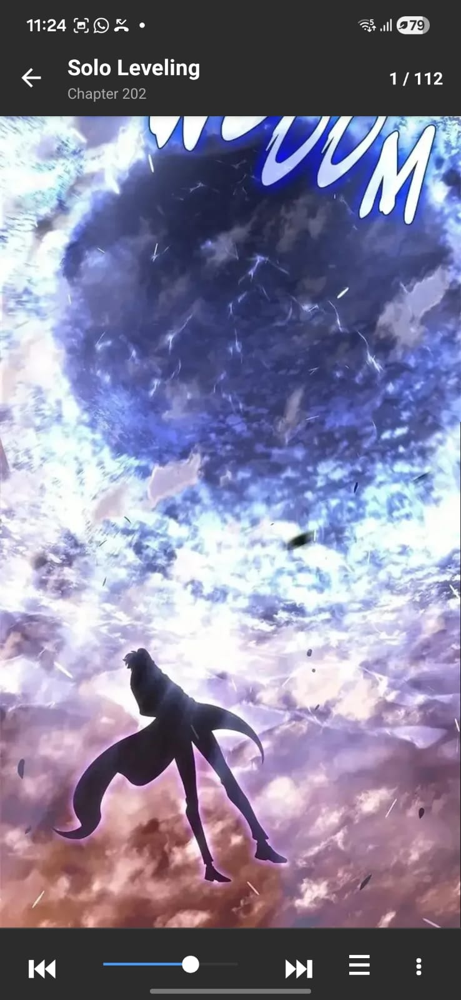
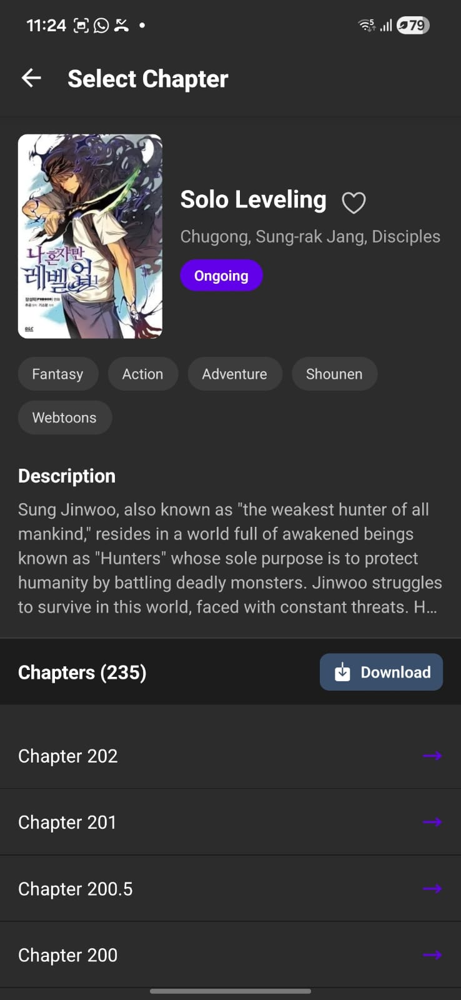
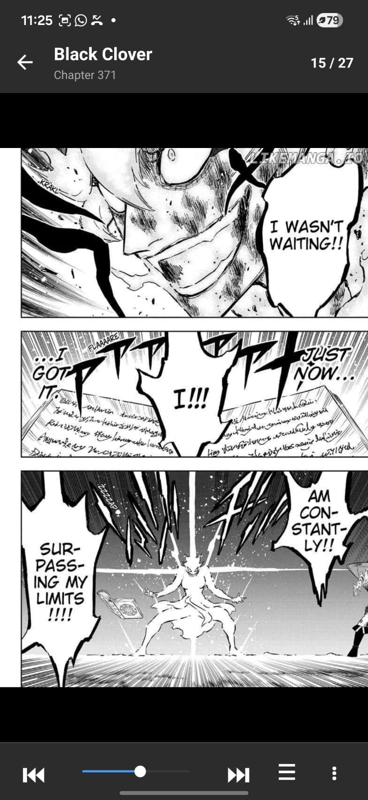
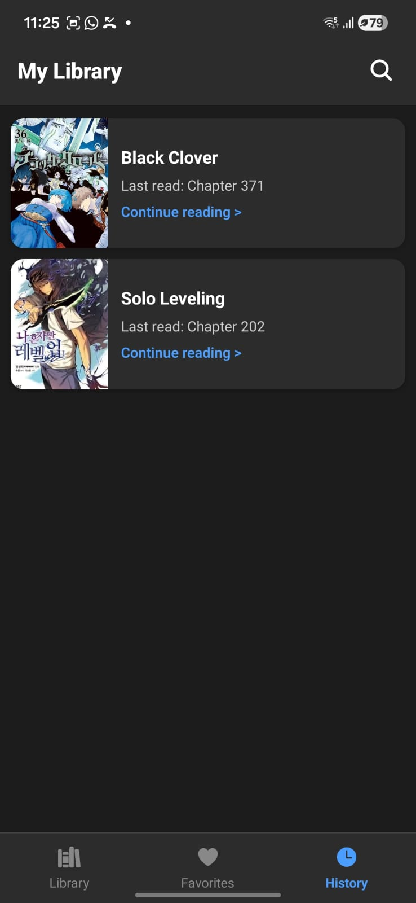
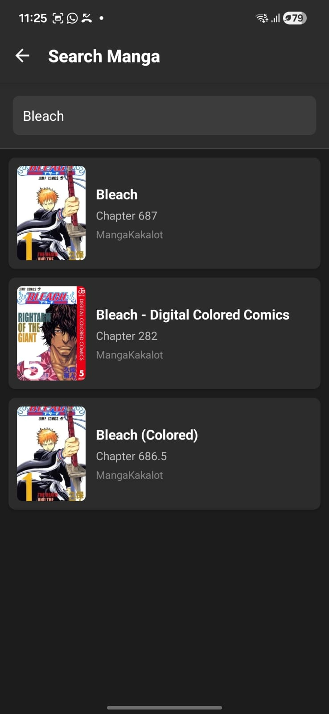
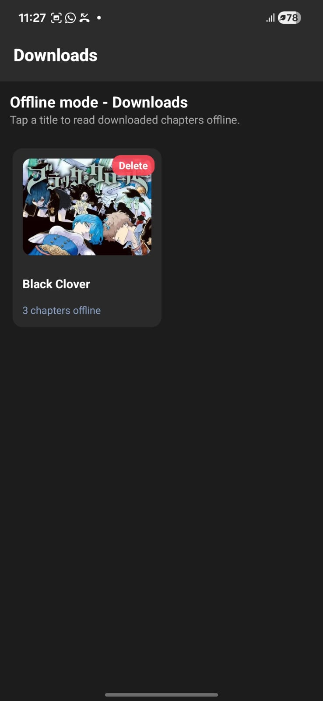
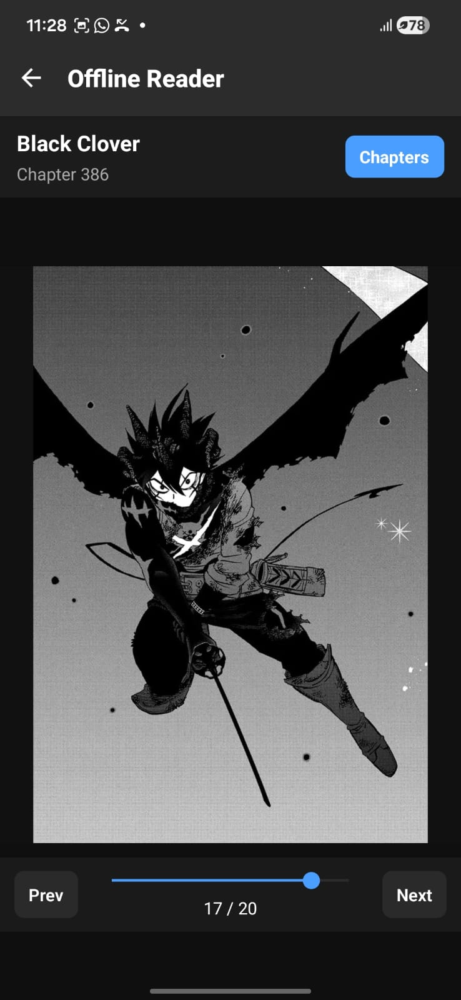
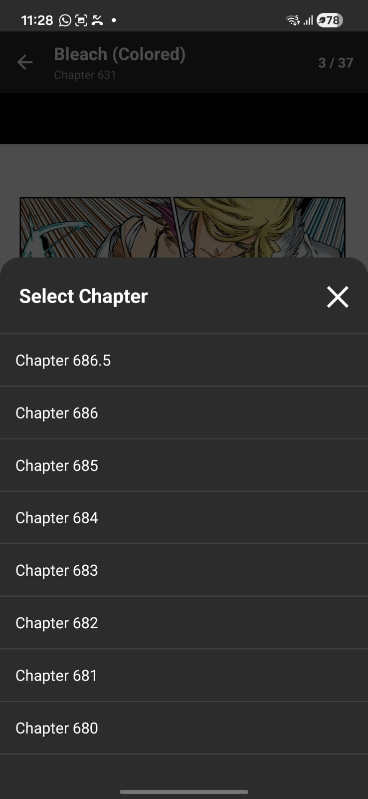
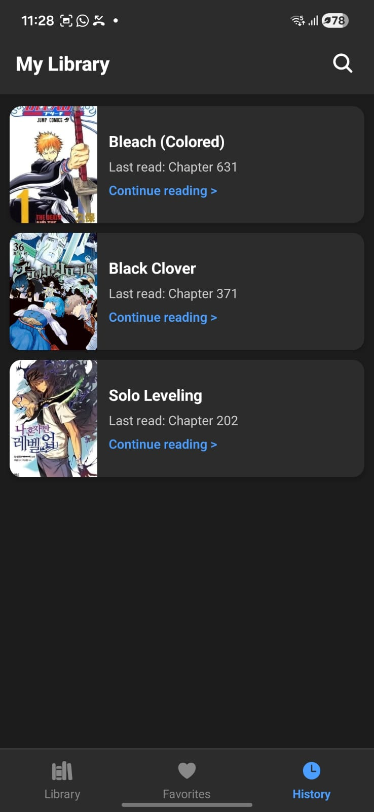
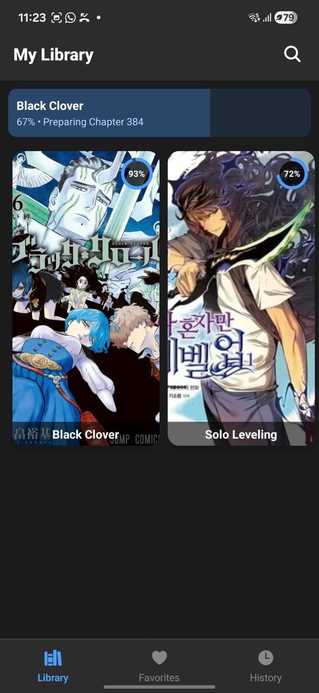

# Manga Reader

A mobile application built with React Native for reading manga online and offline.

<details>
  <summary><b>Here are some screenshots of the app.</b></summary>
  <br>
  <p align="center">
    
    
    
    
    
    
    
    
    
    
    
  </p>
</details>

## Features

- **Discover & Search**: Browse through a vast catalog of manga and search for your favorites.
- **Library Management**: Keep track of the manga you are currently reading.
- **Offline Reading**: Download chapters to your device and read them anywhere, even without an internet connection.
- **Customizable Settings**: Adjust the reading experience to your liking.

## Tech Stack & Libraries

This project is built using modern mobile development tools to ensure performance and a smooth user experience.

**Core Technology:**
- **[React Native](https://reactnative.dev/) & [React](https://react.dev/)**
- **TypeScript**

**Key Libraries:**
- **Navigation**: [`React Navigation`](https://reactnavigation.org/) provides smooth stack navigation across the app.
- **Networking**: [`axios`](https://axios-http.com/) is used to fetch manga data and chapters from external sources.
- **Offline Storage**: [`react-native-fs`](https://github.com/itinance/react-native-fs) manages the device file system to save downloaded manga chapters for offline reading.
- **Image Rendering**: [`react-native-fast-image`](https://github.com/DylanVann/react-native-fast-image) provides high-performance image caching, which is critical for reading manga seamlessly.
- **Connectivity**: [`@react-native-community/netinfo`](https://github.com/react-native-netinfo/react-native-netinfo) detects internet connection changes to toggle between online and offline modes.
- **UI Components**: Employs [`react-native-vector-icons`](https://github.com/oblador/react-native-vector-icons), [`react-native-linear-gradient`](https://github.com/react-native-linear-gradient/react-native-linear-gradient), and others for a polished interface.

## How It Works

1. **Data Fetching**: The app retrieves manga metadata and chapter images via network requests using `axios`.
2. **Reading Experience**: Chapters are displayed in a smooth scrollable list using `react-native-fast-image` to ensure that pages load quickly and are cached effectively.
3. **Offline Downloads**: When a user chooses to download a chapter, the `downloadManager.ts` utilizes `react-native-fs` to save the raw image files directly to the device's local storage.
4. **Network Awareness**: By listening to `netinfo`, the app knows when you are offline and seamlessly redirects reading requests to your locally downloaded files instead of the web.

## Prerequisites

- Node.js
- npm or Yarn
- React Native development environment (Android Studio / Xcode)

## Getting Started

1. **Install dependencies**:
   ```bash
   npm install
   # or
   yarn install
   ```

2. **Start the Metro Bundler**:
   ```bash
   npm start
   # or
   yarn start
   ```

3. **Run the application**:
   - For Android:
     ```bash
     npm run android
     # or
     yarn android
     ```
   - For iOS (macOS only):
     ```bash
     cd ios
     pod install
     cd ..
     npm run ios
     # or
     yarn ios
     ```

## Project Structure

- `App.tsx` - Main application entry point.
- `MangaReader.tsx` - Core reading interface.
- `ChapterList.tsx` - Displays available chapters for a manga.
- `Library.tsx` - User's saved or favorited manga collection.
- `Downloads.tsx` & `OfflineReader.tsx` - Interface for managing downloaded content and reading without an internet connection.
- `Search.tsx` - Search functionality to find new manga.
- `Settings.tsx` - App configuration and preferences.
- `downloadManager.ts` - Logic for handling offline chapter downloads.

## License

This project is open-source and available under the MIT License.
